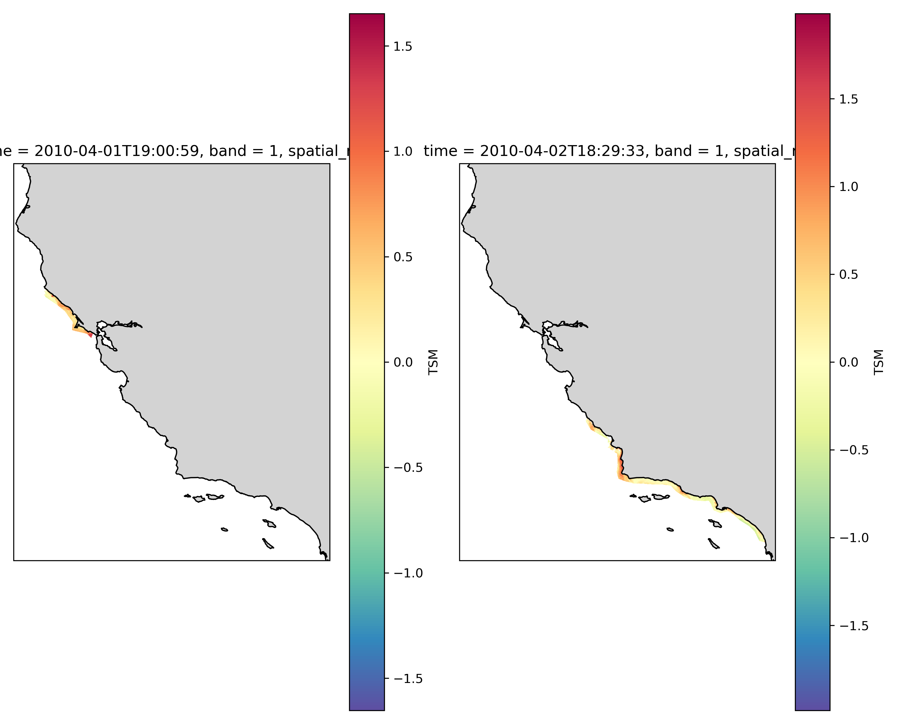

# MERIS TSM Processing Pipeline

This pipeline automates the end-to-end processing of MERIS Level-2 Full Resolution (FRS) Total Suspended Matter (TSM) data from NASA's LAADS DAAC, transforming swath granules into georeferenced GeoTIFFs suitable for coastal monitoring and large-scale analysis.



## Features

- Search & Download: Automated MERIS granule discovery using earthaccess
- Unzip & Extract: Handles nested .zip archives and extracts relevant NetCDFs (TSM_NN and geo_coordinates)
- Swath-to-Grid: Regrids swath data to a regular lat/lon grid using pyresample (nearest-neighbor, no interpolation)
- GeoTIFF Output: Generates CRS-aware, tiled GeoTIFFs
- Time Stacking: Concatenates all GeoTIFFs into a daily-resolved time stack (optionally clipped by shapefile)
- Dask Parallelism: Supports multithreaded local compute for fast processing

## Project Structure

```text
meris_pipeline/
├── main.py                            # Pipeline entry point
├── config.yaml                        # User config with bbox, date range, output path
├── query/
│   └── query.py                       # Queries and downloads granules
├── processing/
│   ├── postprocess.py                 # Extracts NetCDFs, calls regridder
│   ├── create_geotiff_from_swath.py  # Regridding using pyresample
│   └── stack_tsms_from_geotiffs.py   # Time-stacks GeoTIFFs
├── utils/
│   └── config.py                      # YAML config loader
├── requirements.txt                   # pip dependencies
├── environment.yml                    # Conda environment spec
└── MERIS_downloads/                   # Output folder (zips, geotiffs, netcdfs)

```

## Installation
Run the pipeline using your custom config file:

Set up the Conda environment:

```bash
conda env create -f environment.yml
conda activate meris_tsm
```

Or using pip:
```bash
pip install xarray rioxarray geopandas earthaccess pyresample cartopy dask[complete] matplotlib numpy pandas shapely rasterio netCDF4 scipy tqdm pyyaml

```

## Usage
Prepare a config file (example config.yaml)
```yaml
bbox: [-130, 30, -110, 50]   # [west, south, east, north]
start: 2010-04-01
end: 2010-04-05
out: ./MERIS_downloads

```
Then run: 
```bash
python meris_pipeline/main.py --config meris_pipeline/config.yaml

```

To skip querying and only run stacking:
```bash
python meris_pipeline/main.py --config meris_pipeline/config.yaml --skip_query

```

Optional shapefile clipping:
```bash
python meris_pipeline/main.py --config meris_pipeline/config.yaml --shapefile path/to/roi.shp

```

## Output
- GeoTIFFs: MERIS_downloads/geotiffs/TSM_<timestamp>.tif
- Stacked NetCDF: MERIS_downloads/stacked_tsm.nc
- Optionally: daily-averaged NetCDF, clipped versions, etc.

## Notes
- Swath data is **not interpolated** — nearest-neighbor regridding minimizes spectral distortion.
- Requires Earthdata Login credentials for `earthaccess`.

## Coming Soon
- Merging Sentinel-3 OLCI TSM data for expanded temporal coverage.
- Zarr-based output support for scalable, cloud-ready analysis.

## Next Steps
- Integrate QA checks and tile validity reporting.
- Enable optional cloud export (e.g., S3 buckets).
- Further optimize parallelism for server-based batch subsetting.

